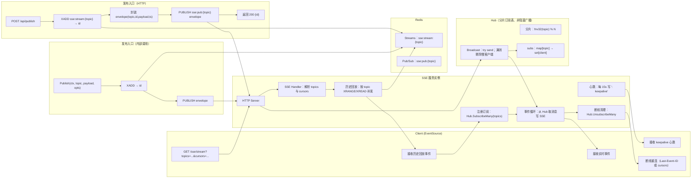
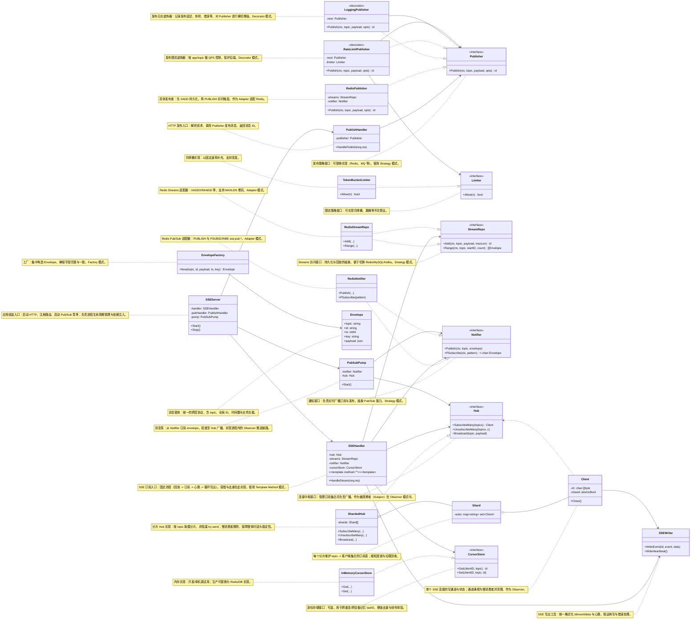

# 通用高并发 SSE 平台与 Go 目录架构

目标
- 推送所有业务消息均可通过 SSE；支持 HTTP 发布和服务内直接调用
- Redis 作为消息“真相来源”，保证“至少一次投递”，断线可回放
- 高并发、低时延、可扩展，简化依赖

---

## 1) 详细流程图（订阅、回放、实时广播、发布）

说明
- 流程包含：客户端订阅、历史回放、实时广播、HTTP 发布、内部发布、断开清理
- 采用 Redis Streams 做持久化；Pub/Sub 做实时触发；Hub 做本机连接管理与非阻塞下发



要点
- 回放与实时并存：先回放，再订阅实时；避免回放窗口内的消息漏送
- 非阻塞广播：慢客户端直接剔除，保护整体时延
- 断线重连：客户端带 `Last-Event-ID`（单 topic）或 `cursors`（多 topic）从 “id 大于游标” 处补发

---

## 2) 类图（含设计模式）

说明
- 采用端口-适配器（Hexagonal）组织：核心依赖接口，Redis 作为适配器
- 使用多种设计模式：Observer、Strategy、Decorator、Factory、Template Method、Adapter



设计模式标注
- Observer：`Hub` 作为主题，`Client` 作为观察者，`Broadcast` 通知
- Strategy：`StreamRepo` 与 `Notifier` 为可替换策略（Redis 实现、未来可换 MySQL/Kafka）
- Decorator：`LoggingPublisher`、`RateLimitPublisher` 装饰 `Publisher` 增加日志与限流
- Template Method：`SSEHandler.HandleStream` 固化“回放→订阅→心跳→循环”步骤
- Factory：`EnvelopeFactory` 统一封装消息格式
- Adapter：`RedisStreamRepo`、`RedisNotifier` 适配 Redis API

---

## 3) Go 目录架构（可落地）

目录树
```
sse-platform/
├─ cmd/
│  └─ sse-server/
│     └─ main.go                    # 组装依赖，启动 HTTP、Pub/Sub 泵
├─ internal/
│  ├─ api/
│  │  └─ http/
│  │     ├─ routes.go               # 注册路由
│  │     ├─ sse_handler.go          # SSE 订阅(回放+实时)
│  │     └─ publish_handler.go      # HTTP 发布
│  ├─ app/
│  │  ├─ sse/
│  │  │  ├─ service.go              # Template Method: HandleStream 流程
│  │  │  └─ cursors.go              # 游标解析、Last-Event-ID 支持
│  │  └─ publish/
│  │     ├─ service.go              # Publisher 组合与装饰
│  │     └─ options.go              # 发布选项(Trim MaxLen 等)
│  ├─ domain/
│  │  ├─ envelope.go                # Envelope 定义与工厂
│  │  └─ errors.go
│  ├─ ports/
│  │  ├─ hub.go                     # Hub 接口
│  │  ├─ notifier.go                # Notifier 接口
│  │  ├─ streams.go                 # StreamRepo 接口
│  │  ├─ publisher.go               # Publisher 接口
│  │  └─ cursor_store.go            # 可选：持久化游标接口
│  ├─ adapters/
│  │  ├─ hub/
│  │  │  ├─ sharded_hub.go         # 分片 Hub 实现
│  │  │  └─ client.go
│  │  └─ redis/
│  │     ├─ streams_repo.go         # XADD/XRANGE/XREAD 实现
│  │     ├─ notifier.go             # (P)SUBSCRIBE / PUBLISH
│  │     └─ pubsub_pump.go          # PSUBSCRIBE sse:pub:* -> Hub.Broadcast
│  ├─ pkg/
│  │  ├─ logger/
│  │  │  └─ logger.go
│  │  ├─ id/
│  │  │  └─ id.go                   # 请求/连接 ID
│  │  ├─ rate/
│  │  │  └─ limiter.go              # 发布限流(可选)
│  │  ├─ retry/
│  │  │  └─ retry.go                # 发布重试(可选)
│  │  └─ config/
│  │     └─ config.go               # 读取 env/yaml
│  └─ bootstrap/
│     └─ wire.go                    # 依赖注入组装（可选）
├─ configs/
│  └─ config.yaml                   # Redis 地址、分片数、心跳周期、Streams MaxLen
├─ scripts/
│  ├─ run_local.sh
│  └─ load_test_sse.js              # 简易压测脚本
└─ go.mod
```
